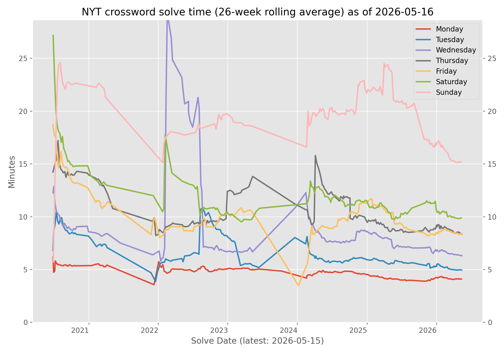

# Crossword

Track and visualize your New York Times Crossword solve times over time.

This repository contains:
- A Rust CLI that scrapes NYT crossword metadata/solve stats into `data.csv`
- A Python plotting script that generates a trend graph
- A GitHub Actions workflow that refreshes data and updates this README daily

## Automated Daily Stats

<!-- crossword-graph:start -->
## NYT Crossword Times



- **Last scraped (UTC):** 2026-05-16 11:38 UTC
- **Today’s completion time:** Not solved yet

_Updated daily by GitHub Actions._
<!-- crossword-graph:end -->


## How it works

1. `cargo run --release -- -t "$NYT_S_COOKIE" -s 2016-01-01 data.csv` updates the local CSV database.
2. `python plot/plot.py data.csv assets/crossword-times.png` generates the graph image.
3. `.github/workflows/main.yml` runs daily and commits updated CSV/graph/README content.

## Local usage

### Prerequisites
- Rust toolchain
- Python 3.12+
- A valid NYT subscription token

### Run the scraper

```bash
cargo run --release -- -t "$NYT_S_COOKIE" -s 2016-01-01 data.csv
```

You can also use environment variables supported by the CLI (for example `NYT_S_COOKIE` and `NYT_XWORD_START`).

### Generate the plot

```bash
python -m pip install -r plot/requirements.txt
python plot/plot.py data.csv assets/crossword-times.png
```

## Tests

```bash
cargo test
```
